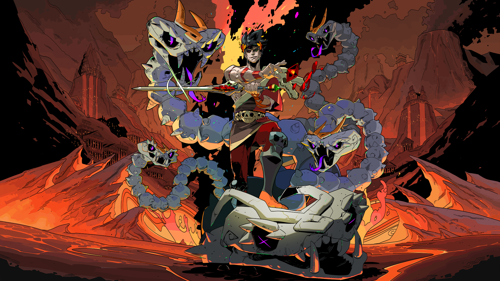
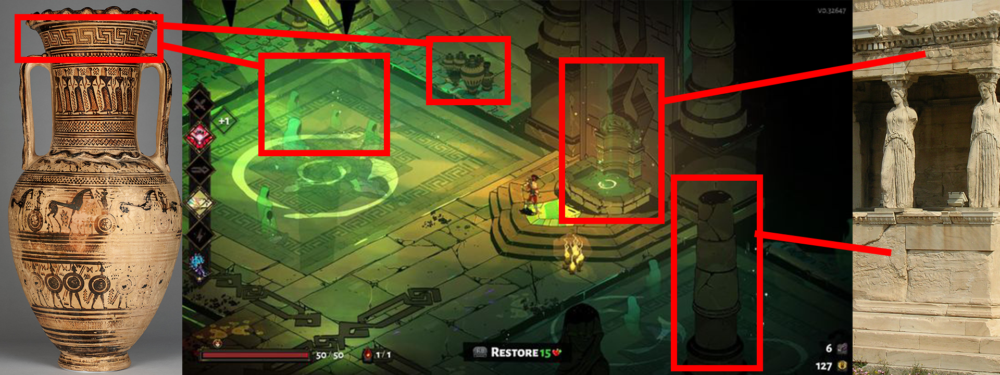
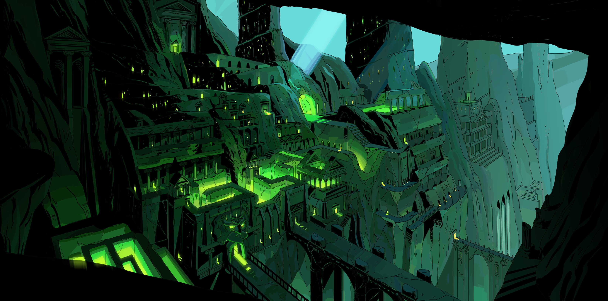
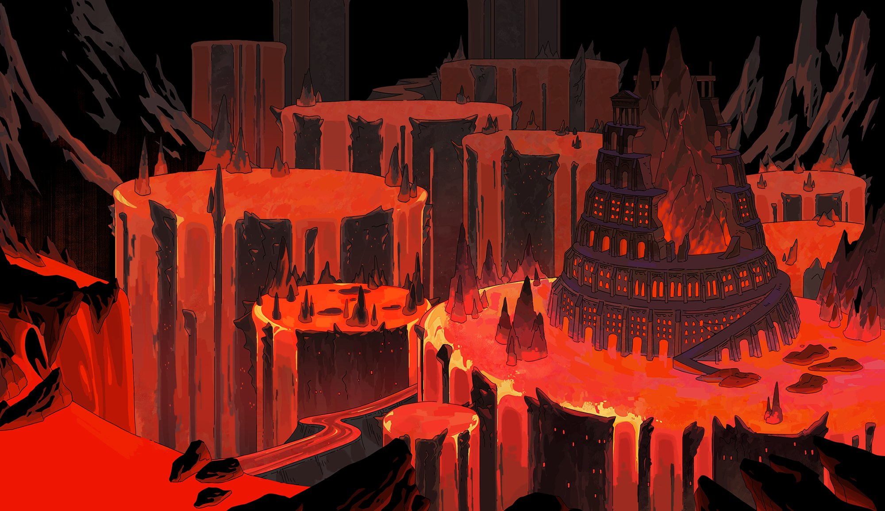
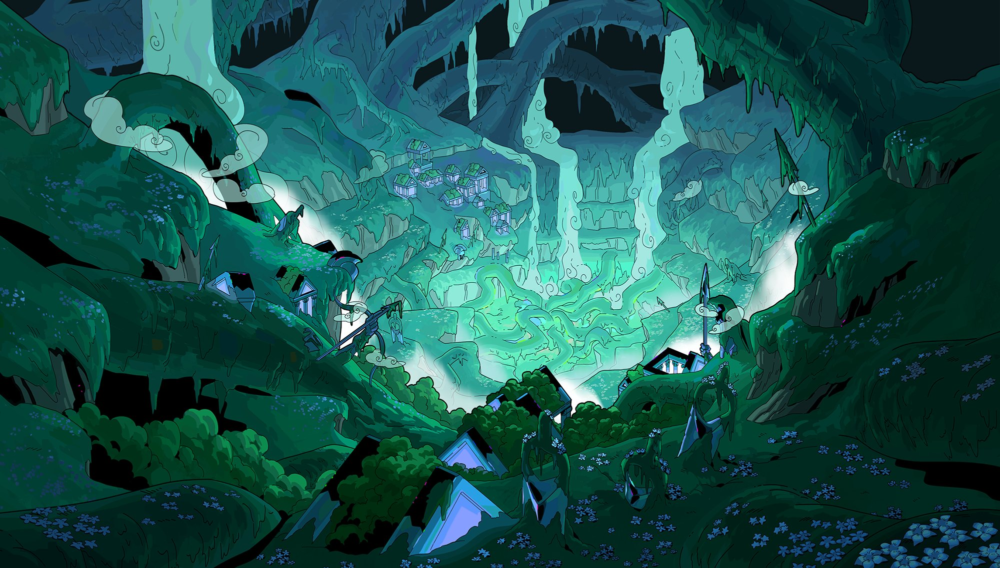
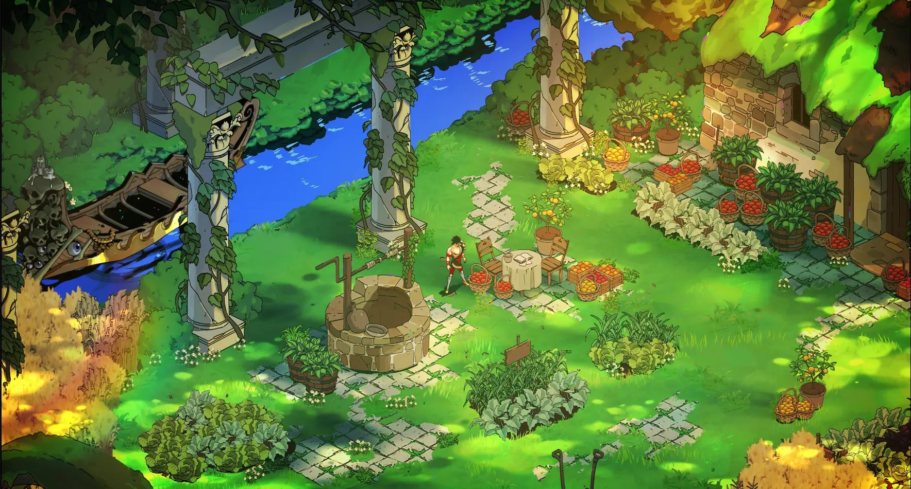
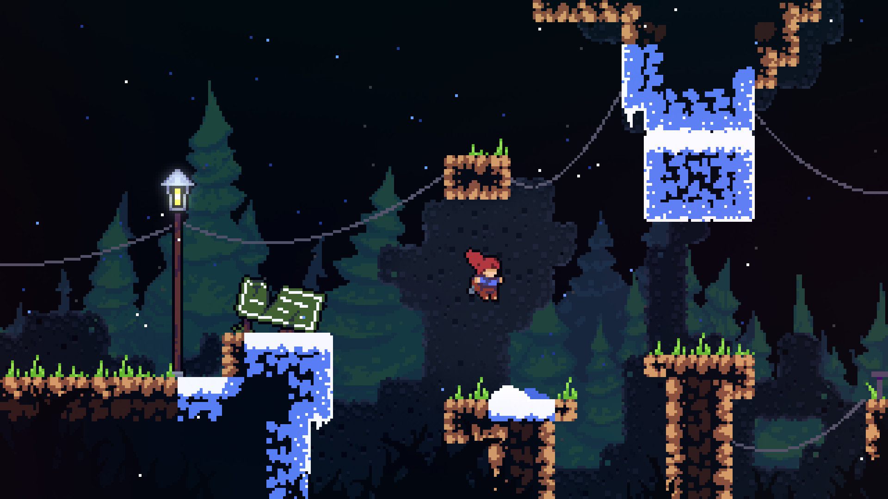
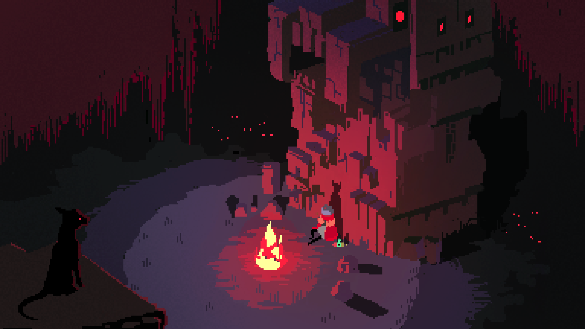
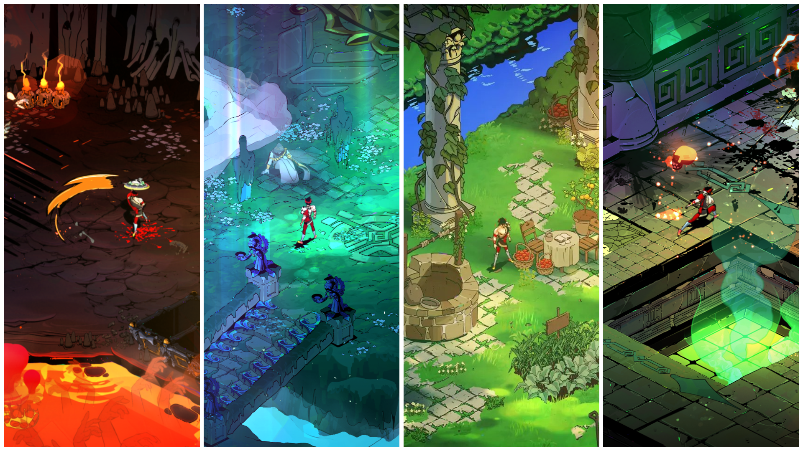

# Hue and Myth: The Transformative Role of Colour in Hades (2020) - 1192 words (excluding references)

## Introduction

The indie game *Hades (2020)* by Supergiant Games has garnered critical acclaim not only for its innovative gameplay but also for its use of artistic techniques, particularly its employment of colour. *Hades* utilizes a carefully curated palette to enhance its narrative and evoke specific emotional responses from players. This essay deconstructs the artistic use of colour within *Hades*, focusing on the deliberate contrast between the various sections of the underworld—such as Tartarus, Asphodel, and Elysium—and the bright, liberating overworld encountered upon escape. Critical reviews from gaming websites have highlighted that *Hades*’ visual storytelling elevates its mythological narrative, setting a new benchmark for interactive narrative design (IGN, 2020; Polygon, 2020). Through these means, hue, saturation and tonal choices serve both aesthetic and narrative functions.

> Figure 1 - Promo Image from Supergiant Games Press Kit

## Background and Context

*Hades* exemplifies how a small indie game can achieve visual sophistication on par with large-scale productions. Developed by Supergiant Games, the title blends traditional hand-painted art with advanced digital effects to create a visually immersive world. Drawing heavily on classical Greek mythology (fig. 2), *Hades* reinterprets ancient themes through modern game design, where every colour is imbued with narrative significance (IGN, 2020).

> Figure 2 - Greek Pottery and architecture examples alongside a screenshot from Hades

In digital art and game design, colour is not merely decorative; it is instrumental in evoking mood and conveying story. Reviews have emphasized that *Hades* uses deliberate contrasts in its colour palettes to guide players through an emotional journey. For example, the subdued tones of Tartarus evoke feelings of despair, while the fiery hues of Asphodel suggest struggle and purification. Such deliberate colour segmentation not only reinforces the distinct identities of each underworld region but also acts as a visual cue that mirrors the player’s progression (Eurogamer, 2020; Kotaku, 2020). By marrying colour theory with narrative function, *Hades* offers an experience where every visual element contributes to both atmosphere and story.

## Deconstruction of Colour Use in Hades

The artistic use of colour in *Hades* stands as a central pillar of its design philosophy, with each region of the underworld defined by a distinctive palette that mirrors its mythological and emotional context. In Tartarus, deep blues, grays, and near-monochromatic hues create an atmosphere of suffocating despair and entrapment. This muted palette, combined with low dynamic lighting (Fig. 3), reinforces the region’s portrayal as a prison for tormented souls—its lack of vibrant colour mirroring the hopelessness of its inhabitants (Rock Paper Shotgun, 2020).

> Figure 3 - Concept Art of Tartarus - by Joanne Tran

Moving upward, Asphodel is rendered in warm, fiery tones dominated by reds and oranges. This palette conjures images of purgatory and relentless struggle. Reviewers have noted that the higher saturation (Fig.4) in Asphodel symbolizes both the physical heat of a burning realm and the emotional intensity of its mythological narrative (PC Gamer, 2020). The interplay between these saturated hues and stark shadows creates a visual rhythm that effectively communicates perpetual conflict and renewal.

> Figure 4 - Concept Art of Asphodel - by Joanne Tran

In stark contrast, Elysium employs a much lighter, more ethereal colour scheme composed of soft pastels and luminous highlights. This region’s gentle palette (Fig. 5) evokes hope and redemption—offering a visual oasis amid the torment of the underworld. Critics have praised the shift in hue, noting that Elysium’s airy colours serve as a powerful metaphor for transcendence and the promise of peace (GameSpot, 2020).

> Figure 5 - Concept Art of Elysium - by Joanne Tran

Beyond the underworld, *Hades* underscores its narrative through the transition to the overworld (Greece). Upon escaping the confines below, players are greeted by a vibrant palette of greens, clear blues, and natural sunlight (Fig.6). This stark contrast is symbolic; the overworld’s bright, natural hues represent liberation and the resurgence of life. Reviews from Destructoid (2020) and VG247 (2020) highlight that these bright colours, combined with dynamic lighting effects, evoke a sense of freedom and renewal that marks a definitive narrative shift.

> Figure 6 - Screenshot of The Overworld (Greece)

Technically, the effective implementation of these varied palettes is achieved through a fusion of hand-painted assets and real‑time digital effects. The integration of dynamic lighting and particle systems means that the game’s colours evolve with gameplay, reinforcing narrative shifts in real time. As noted by The Verge (2020), the deliberate juxtaposition of oppressive underworld hues with the refreshing tones of the overworld not only deepens emotional engagement but also serves as a visual metaphor for rebirth and transformation. In *Hades*, every colour choice is a deliberate narrative decision, inviting players to interpret visual cues in tandem with mythological themes and to experience a rich, immersive emotional journey.

## Comparative Analysis & Critical Perspectives

When compared to other indie titles, *Hades*’ approach to colour is notable for its seamless integration into its narrative framework. While many indie games use colour primarily to establish mood, *Hades*’ palette is intimately tied to storytelling. For instance, *Celeste* adopts a more minimalist approach; its subtle shifts in hue reflect the protagonist’s internal struggles rather than delineating distinct narrative stages. Reviews have observed that *Celeste*’s restrained colour scheme creates an introspective atmosphere, where tonal shifts hint at emotional depth without segmenting its world into mythologically distinct realms (IGN, 2018).

> Figure 7 - Screenshot from *Celeste (2018)* by Matt Makes Games

In contrast, *Hyper Light Drifter* employs a vibrant, neon-inflected palette that creates an otherworldly, retro aesthetic. Its saturated colours are visually striking and contribute to an overall mood of isolation and wonder (Fig.8). However, this approach is more abstract—its colours evoke a consistent atmospheric feel rather than serving as clear narrative signposts. Unlike *Hades*, where each realm’s distinct palette marks a progression in the story from despair to hope, *Hyper Light Drifter*’s approach is geared toward maintaining a uniform mood throughout the game (Polygon, 2016).

> Figure 8 - Screenshot from *Hyper Light Drifter (2016)* by Heart Machine

Critical discussions on websites such as Eurogamer and Kotaku underscore that *Hades*’ deliberate interplay between digital lighting and hand‑painted art offers a narrative depth that transcends simple aesthetic appeal. By using colour as a narrative tool, *Hades* not only tells a story of myth and heroism but also guides players through an emotional journey marked by visual transitions from darkness to light. This nuanced use of colour positions *Hades* as a benchmark for artistic innovation in the indie game scene, setting it apart from titles that rely solely on traditional design methods (Destructoid, 2020).

## Conclusion

The artistic use of colour in *Hades* is a carefully crafted narrative device that transforms visual aesthetics into a storytelling medium. The deliberate segmentation of colour across the underworld—from Tartarus’ oppressive hues and Asphodel’s fiery tones to Elysium’s serene pastels—contrasts sharply with the revitalizing palette of the overworld (Fig.9). This interplay not only heightens the emotional impact of the game but also reinforces its mythological narrative. As highlighted by multiple reviews (The Verge, 2020), *Hades* exemplifies how innovative colour design can serve as a powerful tool in modern indie game storytelling, setting a new standard in visual narrative.

> Figure 9 - The environments of Hades side-by-side

---

## References (The sources of information for ideas/critiques/concepts discussed in the essay)

Destructoid (2020)  
*Hades review: Art, color, and narrative collide in a roguelike gem.* [Online]. Available at: [https://www.destructoid.com/hades-review]

Eurogamer (2020)  
*Hades review: A beautifully challenging escape from hell.* [Online]. Available at: [https://www.eurogamer.net/hades-review]

IGN (2020)  
*Hades Review: The Best Roguelike in Years.* [Online]. Available at:
[https://www.ign.com/articles/hades-review]

IGN (2018)  
*Celeste Review: A Platforming Masterpiece.* [Online]. Available at:
[https://www.ign.com/articles/celeste-review]

Kotaku (2020)  
*Review: Hades blends myth with modern mechanics.* [Online]. Available at:
[https://www.kotaku.com/hades-review]

PC Gamer (2020)  
*Hades review: A masterpiece of style and substance.* [Online]. Available at:
[https://www.pcgamer.com/hades-review]

GameSpot (2020)  
*Hades review: A gorgeously designed escape from the underworld.* [Online]. Available at: [https://www.gamespot.com/hades-review]

Polygon (2020)  
*Hades review: Supergiant strikes again with a masterpiece.* [Online]. Available at: [https://www.polygon.com/hades-review]

Polygon (2016)  
*Hyper Light Drifter review: A pixelated journey through a mysterious world.* [Online]. Available at: [https://www.polygon.com/hyper-light-drifter-review]

Rock Paper Shotgun (2020)  
*The art of Hades: How colour and mythology blend seamlessly.* [Online]. Available at: [https://www.rockpapershotgun.com/hades-art]

VG247 (2020)  
*Hades review: Supergiant's most impressive visual journey yet.* [Online]. Available at: [https://www.vg247.com/hades-review]

The Verge (2020)  
*Hades review: An indie game that redefines narrative and aesthetics.* [Online]. Available at: [https://www.theverge.com/hades-review]

---

## Bibliography (3rd party images used in essay i.e not screenshots created/annotated by the author)

*Figure 1 - Promo Image from Supergiant Games Press Kit* [Online]. Available at:
[https://images.igdb.com/igdb/image/upload/t_original/ar10j0.jpg]

*Figure 3 - Concept Art of Tartarus - by Joanne Tran* [Online]. Available at:
[https://pbs.twimg.com/media/EiONwYUWAAIZNER?format=jpg&name=4096x4096]

*Figure 4 - Concept Art of Asphodel - by Joanne Tran* [Online]. Available at:
[https://pbs.twimg.com/media/EiONxqyXsAAo4V4?format=jpg&name=large]

*Figure 5 - Concept Art of Elysium - by Joanne Tran* [Online]. Available at:
[https://pbs.twimg.com/media/EiON2fKXYAYtb2K?format=jpg&name=large]

*Figure 7 - Screenshot from *Celeste (2018)* by Matt Makes Games* [Online]. Available at:
[https://www.newgamenetwork.com/images/uploads/gallery/Celeste/celeste_03.jpg]

*Figure 8 - Screenshot from *Hyper Light Drifter (2016)* by Heart Machine* [Online]. Available at: [https://www.dropbox.com/scl/fo/cat4x7vrn8tx8h25hqy90/AO0jfsEJerG9OGNOkFpXKIg/Screen%20Shots?preview=STORE_ScreenShot_01.png&rlkey=hd652zfvfv43qrycptlvdh2fz&subfolder_nav_tracking=1&st=os8t3qf3&dl=0]

